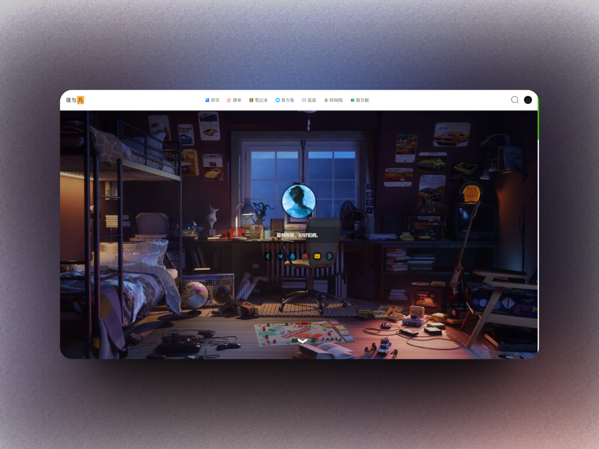

Aurore🌌: 夜与凡博客主题
===

中文 | [Engilsh](README-en.md)

基于 mashirozx 的 [sakura](https://github.com/mashirozx/Sakura) 主题修改的主题

[简易主题下载更新指南](https://github.com/yeyufan1996/Aurore/wiki/Git-%E4%B8%8B%E8%BD%BD%E3%80%81%E6%9B%B4%E6%96%B0%E6%8C%87%E5%8D%97  

如果选择下载压缩包，**解压后记得把文件夹名改回 `Aurore`，即保证主题结构为 `/wp-content/themes/Aurore/`**；  
主题设置在 `菜单-外观-Aurore主题设置` 中；  
DIY 的时候建议采用[子主题](https://github.com/mashirozx/Sakura/tree/child) 并勾选 `Aurore主题设置-CDN-本地调用主题 js、css 文件`；

### 需要服务器吗？
Offer AWS Lightsail service - Contact  [TG](https://t.me/Suran9527)
